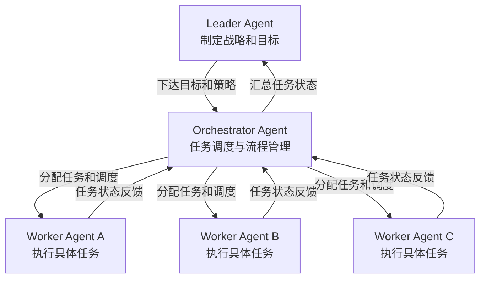

# Multi-Agent Team: Leader vs Orchestrator

```mermaid
flowchart TD
    %% Leader 层
    L[Leader Agent<br/>制定战略和目标]

    %% Orchestrator 层
    O[Orchestrator Agent<br/>任务调度与流程管理]

    %% Worker 层
    W1[Worker Agent A<br/>执行具体任务]
    W2[Worker Agent B<br/>执行具体任务]
    W3[Worker Agent C<br/>执行具体任务]

    %% 流程关系
    L -->|下达目标和策略| O
    O -->|分配任务和调度| W1
    O -->|分配任务和调度| W2
    O -->|分配任务和调度| W3

    %% Worker 回馈
    W1 -->|任务状态反馈| O
    W2 -->|任务状态反馈| O
    W3 -->|任务状态反馈| O
    O -->|汇总任务状态| L
```
