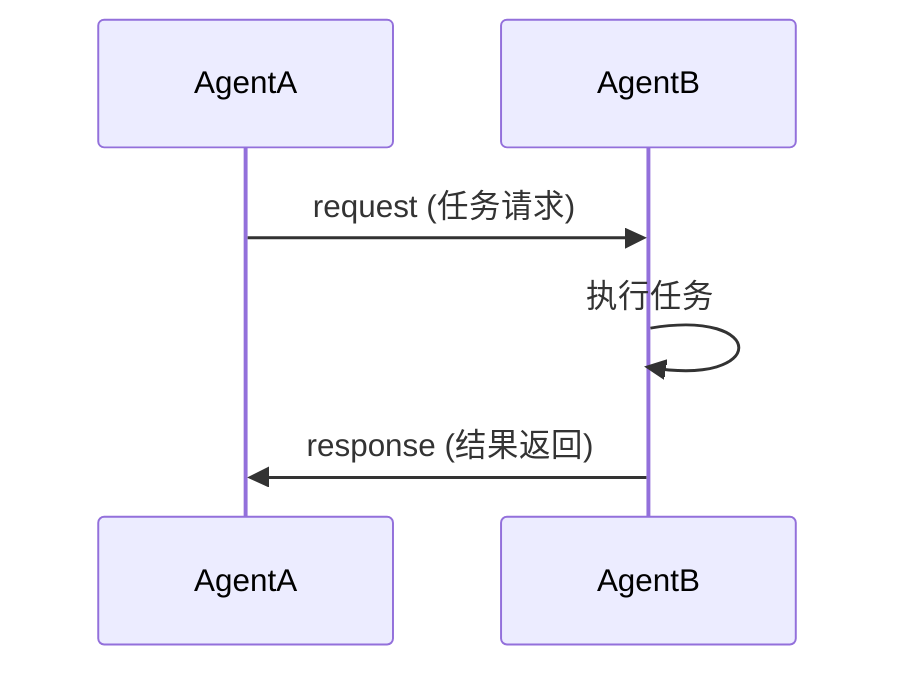

# Skills Team Agent 通信协议

> Skills Team 内部 Agent 间的消息传递规范

**Owner**: skills-team

## 消息格式

### 标准消息结构

```json
{
  "message_id": "MSG-{timestamp}-{sequence}",
  "source_agent": "{agent_name}",
  "target_agent": "{agent_name}",
  "message_type": "{type}",
  "payload": {},
  "context": {
    "workflow_id": "{workflow_id}",
    "step_id": "{step_id}",
    "skill_id": "{skill_id}"
  },
  "timestamp": "{ISO8601}",
  "priority": "{priority}"
}
```

### 消息类型

| 类型 | 说明 | 示例 |
|------|------|------|
| `request` | 请求执行任务 | Discovery → Design: 提案移交 |
| `response` | 响应任务结果 | Design → Discovery: 设计完成 |
| `notification` | 通知状态变化 | Review → Librarian: 审核完成 |
| `escalation` | 升级请求 | Review → Librarian: 冲突仲裁 |
| `query` | 查询信息 | Discovery → Librarian: Skill 索引查询 |
| `ack` | 确认收到 | Librarian → Review: 收到审核报告 |

---

## 通信模式

### 1. 请求-响应模式



**示例**: Discovery → Design

```json
// Request
{
  "message_id": "MSG-20260602080001",
  "source_agent": "Discovery Agent",
  "target_agent": "Design Agent",
  "message_type": "request",
  "payload": {
    "action": "design_skill",
    "skill_proposal": {...}
  },
  "context": {
    "workflow_id": "WF-001",
    "step_id": "creation-02"
  }
}

// Response
{
  "message_id": "MSG-20260602090001",
  "source_agent": "Design Agent",
  "target_agent": "Discovery Agent",
  "message_type": "response",
  "payload": {
    "status": "success",
    "skill_design_doc": {...}
  },
  "context": {
    "workflow_id": "WF-001",
    "step_id": "creation-02"
  }
}
```

### 2. 发布-订阅模式

**用于通知多个 Agent**

```yaml
publish_subscribe:
  topic: "skill_status_changed"
  publisher: Librarian Agent
  subscribers: [Review Agent, Evolution Agent, Skill Orchestrator]
  message:
    skill_id: SKILL-003
    old_status: draft
    new_status: active
```

### 3. 升级模式

**用于冲突解决**

```json
{
  "message_id": "MSG-20260602100001",
  "source_agent": "Review Agent",
  "target_agent": "Librarian Agent",
  "message_type": "escalation",
  "payload": {
    "reason": "连续审核失败",
    "retry_count": 3,
    "conflict_details": {...}
  },
  "priority": "high"
}
```

---

## 优先级定义

| 优先级 | 说明 | 处理时间 |
|--------|------|----------|
| `critical` | 安全问题、阻塞流程 | 立即 |
| `high` | 重要任务、升级请求 | 1 小时内 |
| `medium` | 正常任务 | 4 小时内 |
| `low` | 通知、查询 | 24 小时内 |

---

## 消息验证

### Schema 验证

每条消息必须符合对应 Schema：

| Payload 类型 | Schema |
|--------------|--------|
| skill_proposal | `schemas/skill-proposal.schema.json` |
| skill_design | `schemas/skill-design.schema.json` |
| skill_package | `schemas/skill-package.schema.json` |
| skill_quality_report | `schemas/skill-quality-report.schema.json` |
| skill_release_record | `schemas/skill-release-record.schema.json` |

### 必填字段检查

```yaml
required_fields:
  - message_id
  - source_agent
  - target_agent
  - message_type
  - timestamp
```

---

## 错误处理

### 消息失败处理

| 场景 | 处理 |
|------|------|
| Schema 验证失败 | 拒绝消息，返回错误 |
| 目标 Agent 不可达 | 重试 3 次，升级 Orchestrator |
| 执行超时 | 标记超时，重试或改道 |
| Payload 缺失字段 | 拒绝消息，请求补充 |

### 错误消息格式

```json
{
  "message_id": "MSG-20260602110001",
  "source_agent": "Design Agent",
  "target_agent": "Discovery Agent",
  "message_type": "response",
  "payload": {
    "status": "error",
    "error_code": "VALIDATION_FAILED",
    "error_message": "skill_proposal 缺少必填字段",
    "required_fields": ["scenario"]
  }
}
```

---

## 消息追踪

所有消息记录到日志：

```yaml
message_log:
  message_id: MSG-20260602080001
  workflow_id: WF-001
  source: Discovery Agent
  target: Design Agent
  type: request
  status: delivered
  duration: 1s
```

---

## Metadata

- Version: 1.0
- Owner: Skills Team
- Last Updated: 2026-06-02